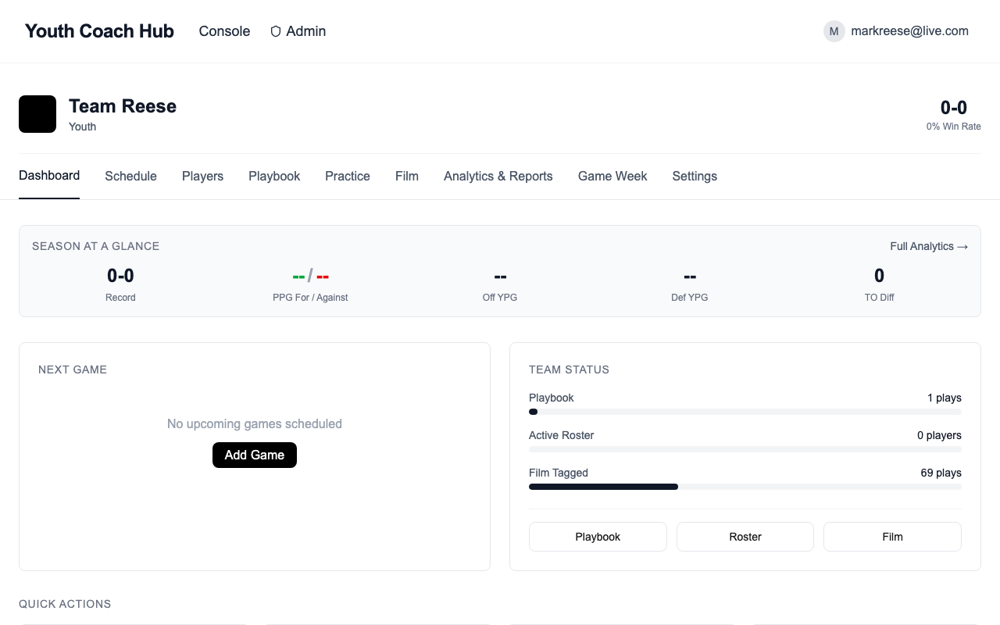
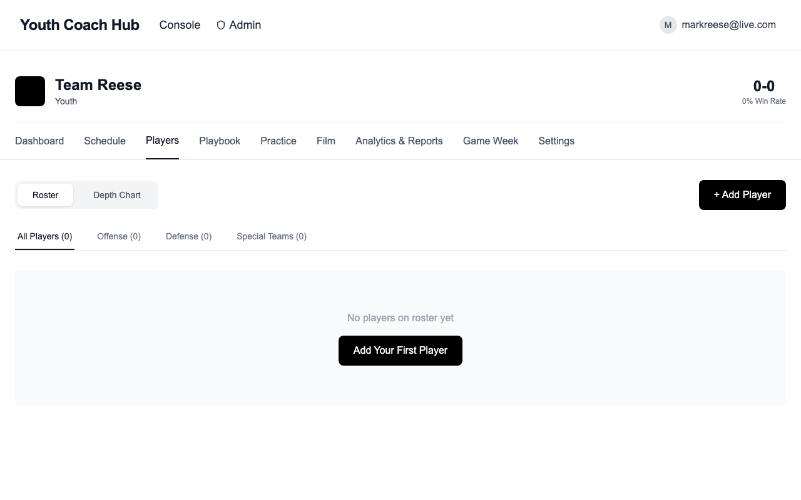
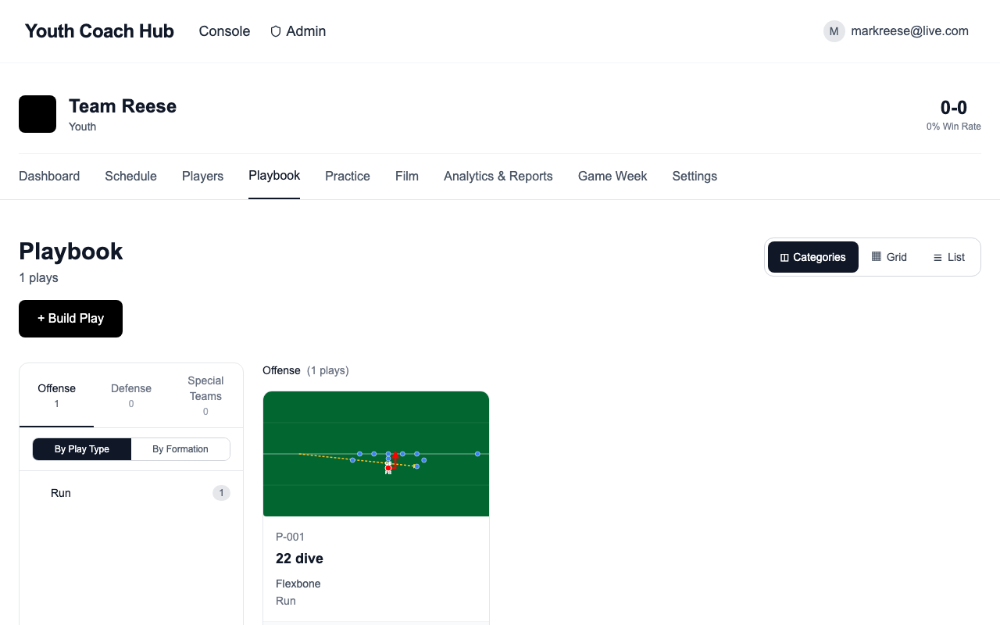
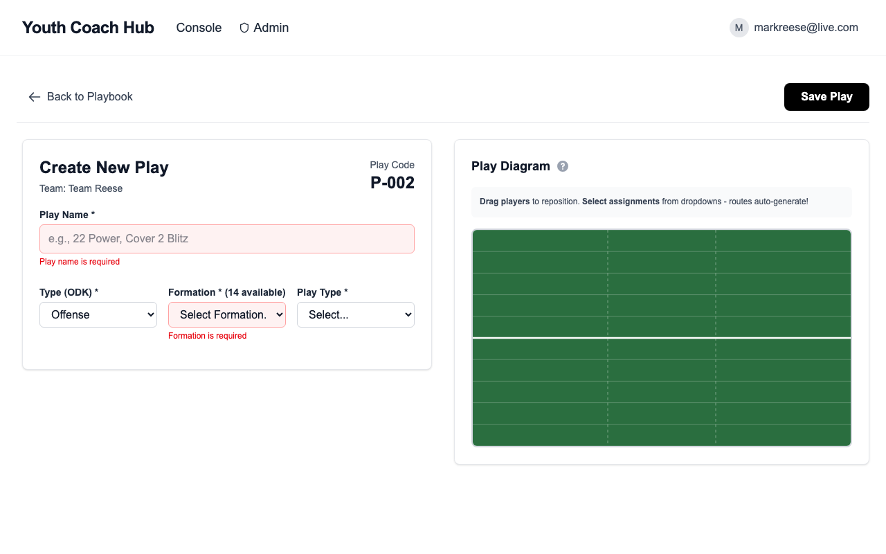
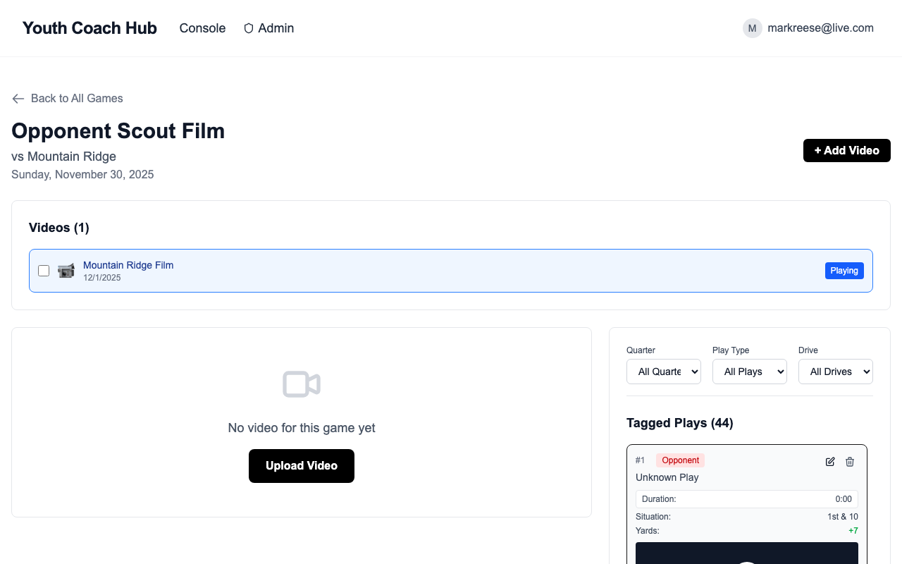
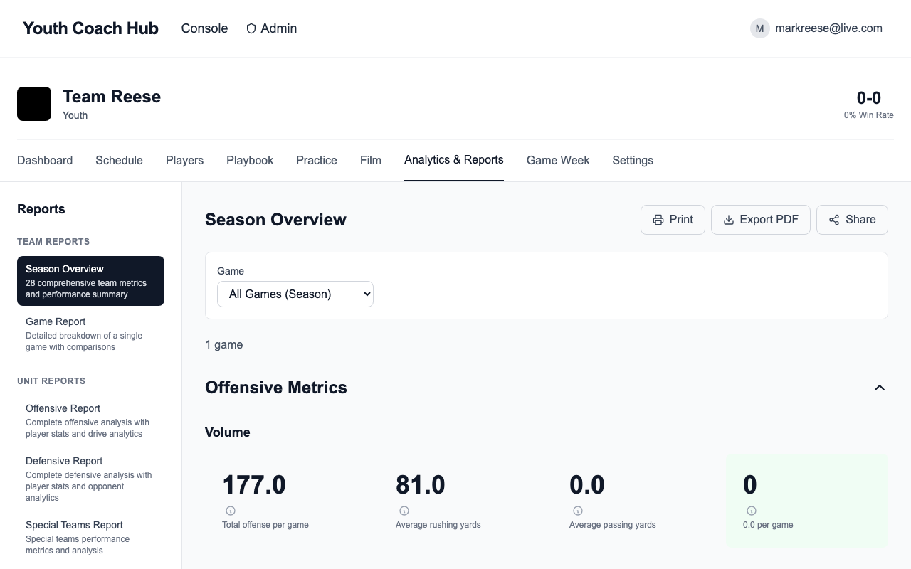
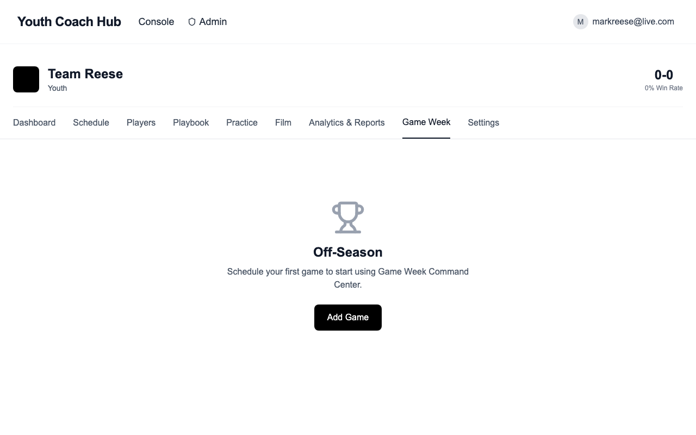
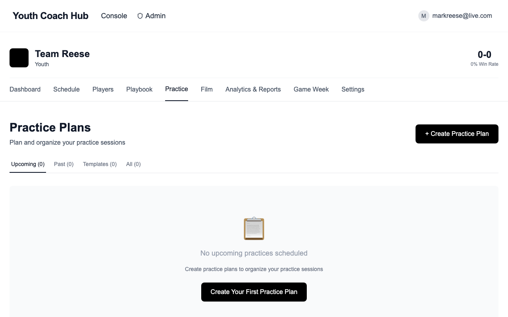
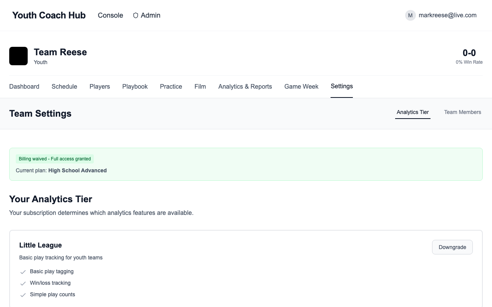

# The Coach Hub

## Getting Started Guide

---

Welcome to The Coach Hub! This comprehensive guide will walk you through setting up your account and using all the features to organize your team, manage your schedule, build your playbook, upload game film, and analyze performance.

**What is The Coach Hub?**

The Coach Hub is a football coaching platform designed for youth and high school coaches. Manage your roster, build digital playbooks, upload and tag game film, track analytics, and prepare for games—all in one place.

---

## Table of Contents

1. [Creating Your Account](#1-creating-your-account)
2. [Setting Up Your Team](#2-setting-up-your-team)
3. [Your Team Dashboard](#3-your-team-dashboard)
4. [Managing Your Schedule](#4-managing-your-schedule)
5. [Managing Your Roster](#5-managing-your-roster)
6. [Building Your Playbook](#6-building-your-playbook)
7. [Uploading & Viewing Game Film](#7-uploading--viewing-game-film)
8. [Tagging & Analyzing Plays](#8-tagging--analyzing-plays)
9. [Analytics & Reporting](#9-analytics--reporting)
10. [Game Planning](#10-game-planning)
11. [Practice Planning](#11-practice-planning)
12. [Team Settings](#12-team-settings)
13. [Tips for Success](#tips-for-success)

---

## 1. Creating Your Account

1. Go to **youthcoachhub.com**
2. Click **"Get Started"** on the homepage
3. Enter your email and password
4. Check your email for a verification link (if required)
5. Click the link to confirm, then log in

---

## 2. Setting Up Your Team

After logging in, you'll need to create your team.

1. Click **"+ Create New Team"**
2. Enter your team name (e.g., "Varsity Football" or "7th Grade Eagles")
3. Select your team level:
   - Youth
   - Middle School
   - JV
   - Varsity
   - College
4. Click **"Create Team"**

---

## 3. Your Team Dashboard

After creating your team, you'll see your dashboard—your central hub for managing everything.

The dashboard provides quick access to:
- **Recent Games** - Quick links to your latest games and film
- **Upcoming Schedule** - See what's coming up
- **Quick Stats** - At-a-glance performance metrics
- **Navigation** - Access all features from the sidebar

---

## 4. Managing Your Schedule

Keep track of all your games and events in one place.

### Viewing Your Schedule

1. Click **"Schedule"** in the navigation
2. View your games in calendar or list format
3. See game details including opponent, date, time, and location

### Adding a Game

1. Click **"Add Game"** button
2. Fill in the game details:
   - **Game Name** (e.g., "Week 1" or "vs. Lincoln")
   - **Opponent**
   - **Date and Time**
   - **Location** (optional)
   - **Home/Away**
3. Click **"Save"**

After the game, you can update the score and result.

---

## 5. Managing Your Roster

Track all your players, positions, and jersey numbers.

### Viewing Your Roster

1. Click **"Roster"** or **"Players"** in the navigation
2. See all players with their:
   - Jersey number
   - Name
   - Position
   - Grade/Year

### Adding Players

1. Click **"Add Player"**
2. Enter player information:
   - **First Name** and **Last Name**
   - **Jersey Number**
   - **Primary Position** (QB, RB, WR, LT, etc.)
   - **Position Group** (Offense, Defense, Special Teams)
   - **Grade Level** (for youth teams)
3. Click **"Save"**

**Tip:** You can import players in bulk from a CSV file for faster setup.

---

## 6. Building Your Playbook

Create and organize your entire playbook digitally.

### Viewing Your Playbook

1. Click **"Playbook"** in the navigation
2. Browse plays by category:
   - **Offense** - Running and passing plays
   - **Defense** - Defensive alignments and coverages
   - **Special Teams** - Kickoff, punt, and field goal plays
3. Use filters to find specific formations or play types

### Creating a New Play

1. Click **"New Play"** or **"Create Play"**
2. The Play Builder opens with a football field diagram

3. **Select Play Type:**
   - Offense, Defense, or Special Teams

4. **Choose a Formation:**
   - Select from pre-built formations (Shotgun, I-Form, 4-3, etc.)
   - Players automatically position on the field

5. **Customize Player Positions:**
   - Drag players to adjust their alignment
   - Click on players to assign routes or responsibilities

6. **Add Play Details:**
   - **Play Code** (auto-generated or custom)
   - **Play Name**
   - **Personnel** (11, 12, 21, etc.)
   - **Play Concept** (Inside Zone, Power, Levels, etc.)

7. **Draw Routes:**
   - Click on a player to select them
   - Click on the field to add route waypoints
   - Choose route type (Go, Slant, Curl, etc.)

8. **Save the Play:**
   - Click **"Save Play"**
   - The play is added to your playbook

---

## 7. Uploading & Viewing Game Film

Upload your game videos and organize them by game.

### Film Library

1. Click **"Film"** in the navigation
2. See all your games with associated film
3. Each game shows:
   - Game name and opponent
   - Date
   - Number of videos uploaded
   - Number of plays tagged

### Uploading Film

1. Select a game or create a new one
2. Click **"Add Film"** or **"Upload Video"**
3. Drag and drop your video file, or click to browse
4. Wait for upload to complete

**Supported formats:** MP4, MOV, WebM, AVI, M4V, MPEG

**Maximum file size:** 2 GB per video

### Viewing Film

1. Click on a game to view its film
2. Click on a video to open the film viewer
3. Use playback controls to navigate:
   - Play/Pause
   - Skip forward/backward
   - Playback speed (0.5x, 1x, 2x)
   - Full screen

---

## 8. Tagging & Analyzing Plays

Tag individual plays in your film for analysis.

### Tagging a Play

1. Open a video in the film viewer
2. Navigate to the start of a play
3. Click **"Tag Play"** or use the tagging panel

4. Fill in play details:
   - **Down & Distance** (1st and 10, 3rd and 5, etc.)
   - **Yard Line** (where the play started)
   - **Hash** (left, middle, right)
   - **Play from Playbook** (select the play that was called)
   - **Result** (gain, loss, touchdown, incomplete, etc.)
   - **Yards Gained**
   - **First Down?** (yes/no)
   - **Notes** (any additional observations)

5. Click **"Save"** to record the play

### Navigating Tagged Plays

- Tagged plays appear as markers on the video timeline
- Click a marker to jump directly to that play
- Use the play list to browse all tagged plays
- Filter plays by down, result, or formation

---

## 9. Analytics & Reporting

Track your team's performance with built-in analytics.

1. Click **"Analytics"** in the navigation
2. View key performance metrics:
   - **Success Rate** - Percentage of successful plays
   - **Yards Per Play** - Average yards gained
   - **Explosive Plays** - Big gains (10+ yards)
   - **Red Zone Efficiency** - Scoring percentage inside the 20

### Available Reports

- **By Formation** - See which formations work best
- **By Down & Distance** - Situational performance
- **By Play Type** - Run vs. pass effectiveness
- **By Player** - Individual player statistics
- **Trends** - Performance over time

### Filtering Data

- Filter by game, date range, or opponent
- Compare home vs. away performance
- Analyze specific situations (3rd down, red zone, etc.)

---

## 10. Game Planning

Prepare for upcoming opponents with game planning tools.

### Game Prep Hub

1. Click **"Game Prep"** in the navigation
2. Select an upcoming game
3. Access preparation tools:
   - Scout opponent tendencies
   - Build game-specific call sheets
   - Review relevant film clips

### Game Week

1. Click **"Game Week"** for focused preparation
2. Access your game plan for the week
3. Review:
   - Opponent scouting report
   - Key plays to run
   - Situational adjustments
   - Special teams plans

---

## 11. Practice Planning

Organize your practices efficiently.

1. Click **"Practice"** in the navigation
2. Create practice schedules
3. Assign:
   - Drills and periods
   - Plays to install
   - Time allocations
   - Focus areas

### Practice Features

- **Templates** - Save and reuse practice structures
- **Play Installation** - Track which plays have been installed
- **Period Timing** - Automatic time tracking
- **Notes** - Add coaching points for each period

---

## 12. Team Settings

Customize your team configuration.

1. Click **"Settings"** in the navigation (or the gear icon)
2. Manage team settings:
   - **Team Name** and details
   - **Team Colors** and branding
   - **Coaching Staff** - Invite other coaches
   - **Roster Settings** - Position groups, depth chart
   - **Notification Preferences**

### Inviting Coaches

1. Go to Settings > Coaching Staff
2. Click **"Invite Coach"**
3. Enter their email address
4. Select their role:
   - **Coach** - Full editing access
   - **Analyst** - Can tag plays and view analytics
   - **Viewer** - Read-only access
5. They'll receive an email invitation to join

---

## Tips for Success

### Getting Started

1. **Set up your roster first** - Add all your players with jersey numbers and positions. This makes tagging film much faster.

2. **Start with your base plays** - You don't need to add your entire playbook at once. Start with your 10-15 core plays.

3. **Upload film after each game** - The sooner you upload, the sooner you can start analysis.

### Tagging Plays

4. **Tag plays right after the game** - The details are fresh in your mind, and you'll save time later when game planning.

5. **Use consistent naming** - Name your games consistently (e.g., "Week 1 vs. Lincoln") so they're easy to find.

6. **Start simple** - Begin by tagging just down, distance, and result. Add more detail as you get comfortable.

### Using Analytics

7. **Review analytics weekly** - Check your success rate by formation and down to identify what's working.

8. **Look for trends** - Use analytics to spot patterns—maybe you're more effective running left, or your passing game struggles on 3rd down.

9. **Share with your staff** - Invite assistant coaches so everyone can access the same data.

### Game Planning

10. **Build game plans from your playbook** - Link plays directly from your playbook to your game plan.

11. **Use the opponent's tendencies** - If you've tagged opponent film, use analytics to spot their patterns.

---

## Need Help?

If you have questions or run into issues:

- Visit **youthcoachhub.com/contact**
- Email our support team
- Check the FAQ section

---

**Happy Coaching!**

*The Coach Hub Team*
