# The Coach Hub

## Platform Admin Console Guide

---

This guide covers the Platform Admin Console for managing The Coach Hub platform. The admin console is accessible only to platform administrators and provides tools for managing organizations, users, billing, content moderation, and system settings.

**Access Requirements:**
- You must be logged in with a platform admin account
- Navigate to `/admin` or click the Admin Console link in the user menu

---

## Table of Contents

1. [Admin Dashboard](#1-admin-dashboard)
2. [Organizations Management](#2-organizations-management)
3. [Users Management](#3-users-management)
4. [Revenue Tracking](#4-revenue-tracking)
5. [AI Costs Monitoring](#5-ai-costs-monitoring)
6. [Logs & Audit Trail](#6-logs--audit-trail)
7. [Content Moderation](#7-content-moderation)
8. [System Settings](#8-system-settings)
   - [Feature Flags](#feature-flags)
   - [Tier Configuration](#tier-configuration)
   - [Trial Settings](#trial-settings)
   - [System Health](#system-health)
   - [Storage Settings](#storage-settings)

---

## 1. Admin Dashboard

The admin dashboard provides an at-a-glance overview of the entire platform.

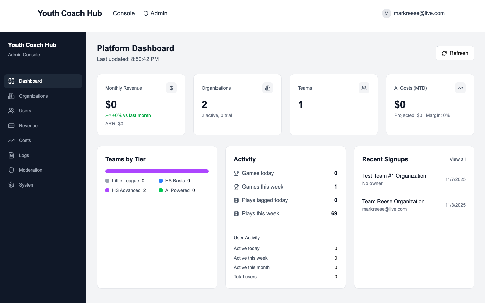

### Key Metrics

- **Monthly Revenue (MRR)** - Current monthly recurring revenue with change vs. last month
- **Annual Revenue (ARR)** - Projected annual recurring revenue
- **Organizations** - Total organizations, active count, and trial count
- **Teams** - Total teams across all organizations
- **AI Costs (MTD)** - Month-to-date AI spending with projected total and margin

### Teams by Tier

Visual breakdown of teams across subscription tiers:
- **Basic** - Entry-level tier
- **Plus** - Full analytics tier
- **Premium** - Advanced analytics tier
- **AI Powered** - Premium tier with AI features

### Activity Metrics

- Games created today/this week
- Plays tagged today/this week
- User activity (active today, this week, this month)

### Alerts

Important alerts appear at the top of the dashboard:
- **High severity** (red) - Immediate action required
- **Medium severity** (yellow) - Should address soon
- **Low severity** (blue) - Informational

### Recent Signups

Latest organization registrations with owner email and signup time.

---

## 2. Organizations Management

View and manage all organizations on the platform.

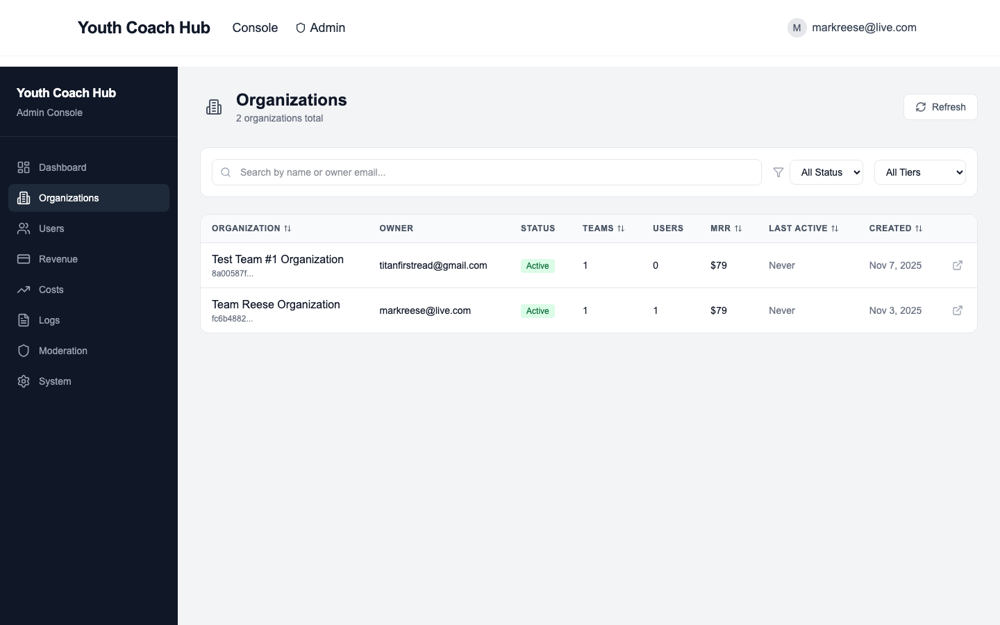

### Features

- **Search** - Find organizations by name or owner email
- **Filter by Status** - Active, Trial, Past Due, Inactive, Churned
- **Filter by Tier** - Basic, Plus, Premium, AI Powered
- **Sortable columns** - Sort by name, teams, MRR, last activity, created date

### Organization Data

Each organization shows:
- Organization name and ID
- Owner email and name
- Status badge (Active, Trial, Past Due, etc.)
- Number of teams and users
- Monthly recurring revenue (MRR)
- Last activity timestamp
- Creation date

### Actions

Click on any organization to view details and:
- View audit log
- Impersonate user (for support)
- Manage subscription
- View all teams and users

---

## 3. Users Management

View and manage all platform users.

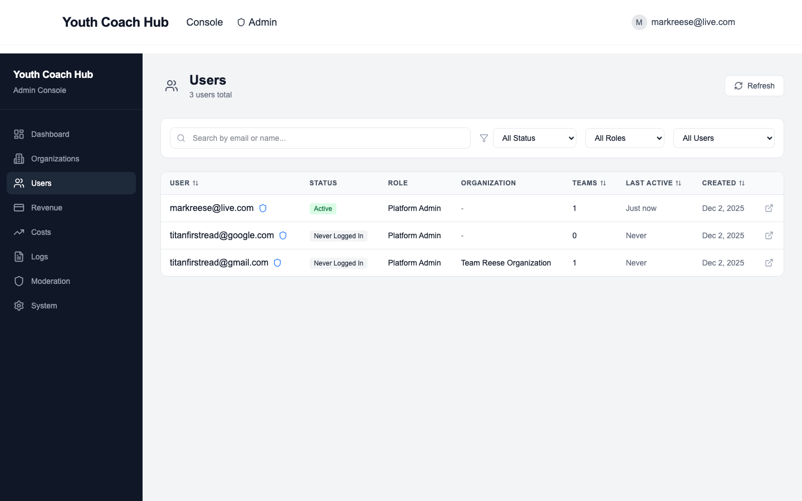

### Features

- **Search** - Find users by email or name
- **Filter by Status** - Active, Inactive, Deactivated, Never Logged In
- **Filter by Role** - Platform Admin, Owner, Coach, Analyst, Viewer
- **Filter by Admin** - All Users, Platform Admins Only, Non-Admins Only
- **Sortable columns** - Sort by email, teams count, last active, created date

### User Data

Each user shows:
- Email address with admin badge if applicable
- Full name
- Status badge
- Role (Platform Admin, Owner, Coach, etc.)
- Organization name
- Number of teams
- Last active timestamp
- Account creation date

### Status Types

- **Active** - Logged in within the last 7 days
- **Inactive** - No login in the last 7 days
- **Deactivated** - Account disabled by admin
- **Never Logged In** - Account created but never accessed

### User Actions

Click on a user to:
- View full profile details
- Send password reset email
- Deactivate/reactivate account
- Grant/revoke platform admin access

---

## 4. Revenue Tracking

Monitor platform revenue and billing metrics.

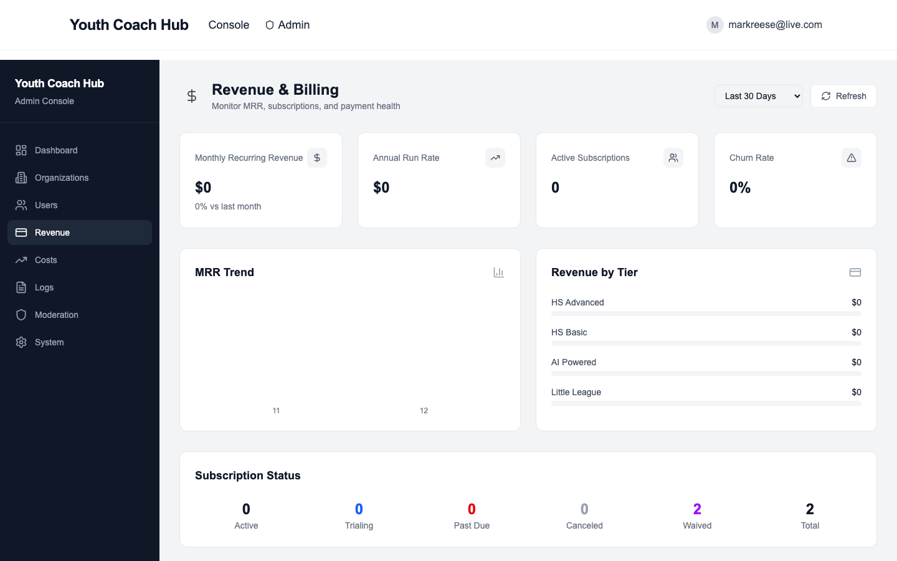

### Metrics

- **Monthly Recurring Revenue (MRR)** - Total monthly subscription revenue
- **Annual Recurring Revenue (ARR)** - MRR x 12
- **MRR Growth** - Month-over-month change
- **Active Subscriptions** - Count of paying customers
- **Trial Conversions** - Trial to paid conversion rate

### Revenue by Tier

Breakdown of revenue contribution by subscription tier.

### Churn Tracking

- Churned customers this month
- Churn rate percentage
- Revenue lost to churn

### Failed Payments

List of failed payment attempts with:
- Organization name
- Amount
- Failure reason
- Option to retry payment

---

## 5. AI Costs Monitoring

Track AI usage costs across the platform.

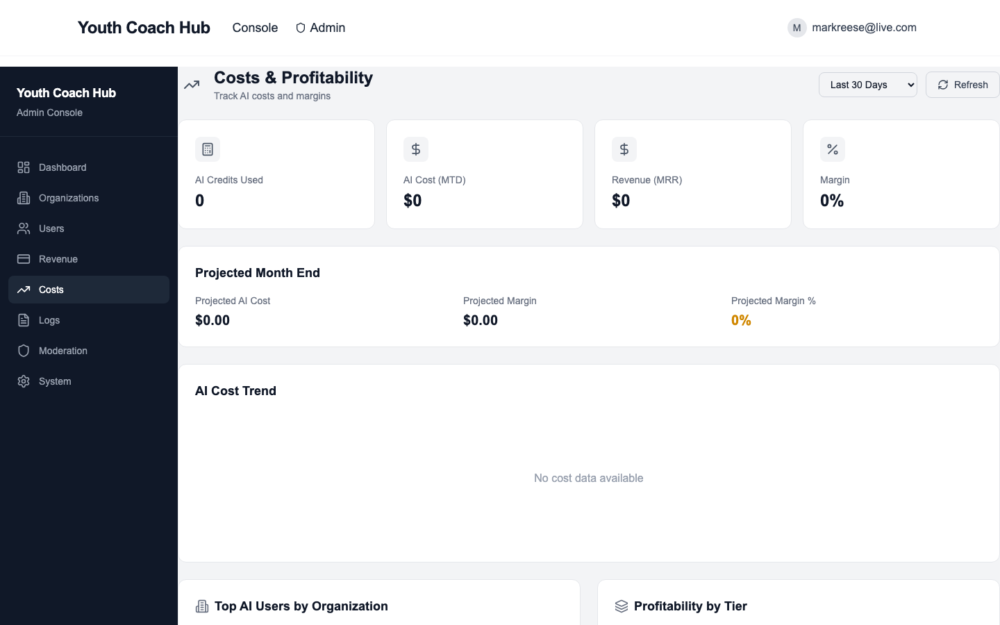

### Overview

- **Month-to-Date Costs** - Current AI spending this month
- **Projected Monthly** - Estimated end-of-month total
- **Margin** - Revenue minus costs percentage

### Costs by Organization

See which organizations are consuming the most AI credits:
- Organization name
- AI credits used
- Cost in dollars
- Percentage of total

### Costs by Tier

Aggregate AI costs by subscription tier to understand usage patterns.

### Cost Alerts

Automatic alerts when:
- Spending exceeds budget thresholds
- Individual organizations use excessive credits
- Margin drops below target

---

## 6. Logs & Audit Trail

Access platform logs for debugging and compliance.

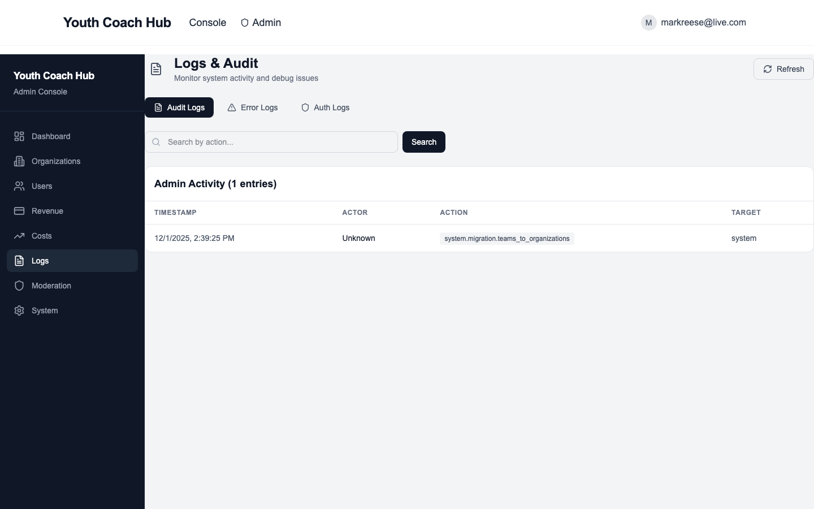

### Log Types

**Audit Logs**
- User actions (create, update, delete)
- Permission changes
- Admin actions
- Subscription changes

**Auth Logs**
- Login attempts (success/failure)
- Password resets
- Session management
- OAuth events

**Error Logs**
- Application errors
- API failures
- Database errors
- Third-party integration issues

### Features

- **Date range filter** - Search within specific time period
- **Severity filter** - Info, Warning, Error, Critical
- **Search** - Find logs by user, action, or content
- **Export** - Download logs for compliance

---

## 7. Content Moderation

Review and moderate uploaded video content.

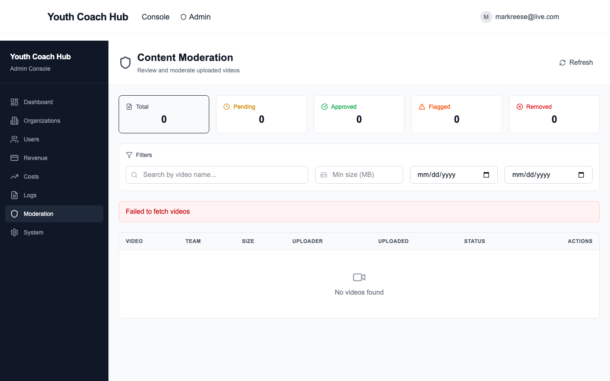

### Status Cards

Quick filter by moderation status:
- **Total** - All uploaded videos
- **Pending** - Awaiting review
- **Approved** - Passed moderation
- **Flagged** - Needs attention
- **Removed** - Blocked content

### Video List

Each video shows:
- Video name and file type
- Team and game association
- File size
- Uploader email and IP address
- Upload timestamp
- Current moderation status

### Filters

- **Search** - Find videos by name
- **Min file size** - Filter large uploads
- **Date range** - Filter by upload date
- **Status** - Filter by moderation status

### Moderation Actions

For each video:
- **View** - Watch the video
- **Approve** - Mark as approved
- **Flag** - Flag for review (requires reason)
- **Remove** - Block the content (requires reason)

### Bulk Moderation

Select multiple videos to:
- Approve all selected
- Flag all selected with common reason

---

## 8. System Settings

Configure platform-wide settings.

### Feature Flags

Toggle features on/off across the platform.

**Managing Flags:**
1. Click **"Add Flag"** to create a new feature flag
2. Enter a name (lowercase with underscores)
3. Toggle the switch to enable/disable
4. Click the trash icon to delete a flag

**Common Feature Flags:**
- `ai_analysis_enabled` - Enable AI play analysis
- `video_transcoding` - Enable video transcoding
- `beta_features` - Show beta features to users
- `maintenance_mode` - Put platform in maintenance mode

---

### Tier Configuration

Manage subscription tier settings.

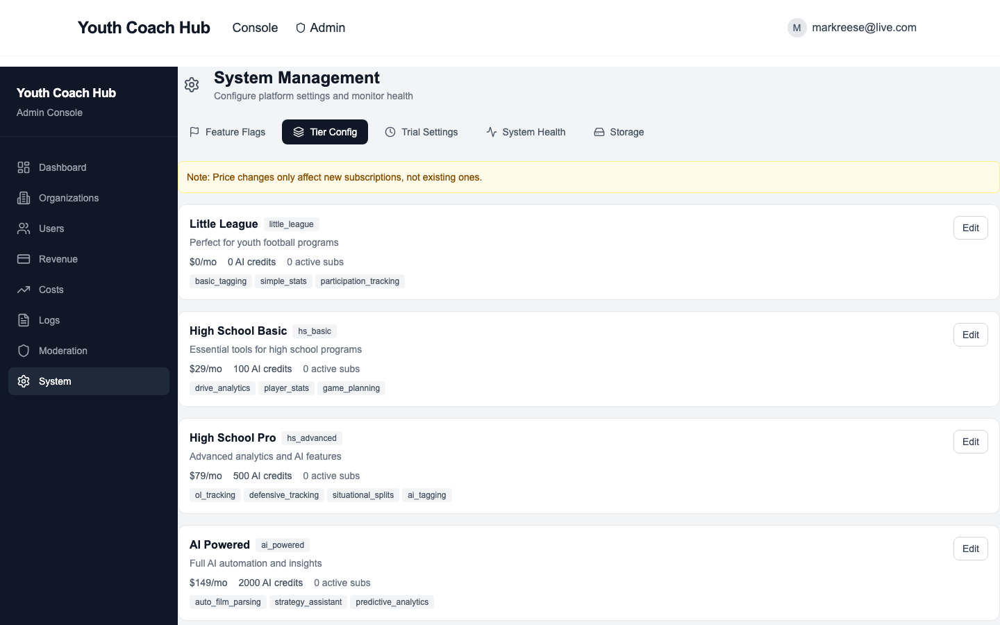

**For each tier:**
- **Name** - Display name
- **Price** - Monthly subscription cost
- **AI Credits** - Monthly AI credit allocation
- **Features** - Included features list
- **Active Subscriptions** - Current subscriber count

**Editing a Tier:**
1. Click **"Edit"** on the tier
2. Modify name, price, credits, or features
3. Click **"Save Changes"**

**Note:** Price changes only affect new subscriptions, not existing ones.

---

### Trial Settings

Configure the free trial experience.

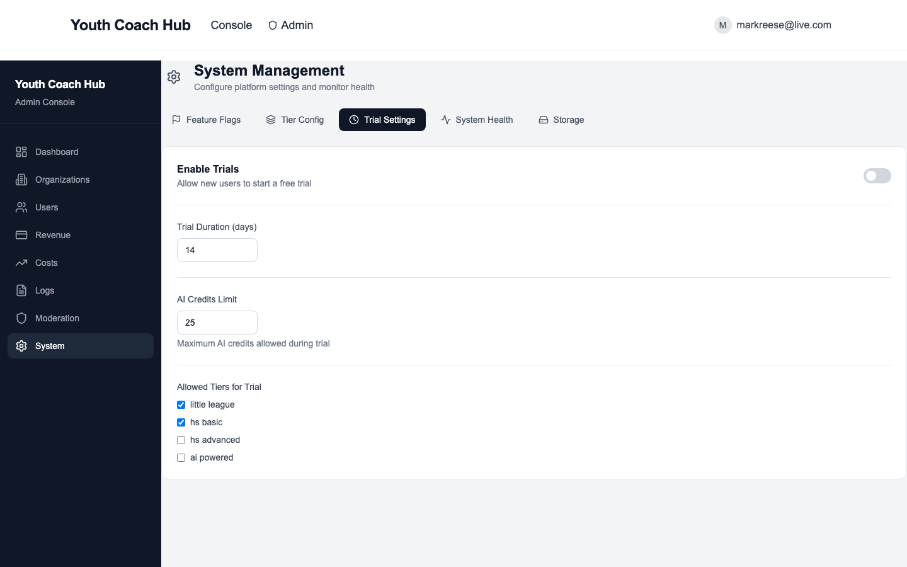

**Settings:**
- **Enable Trials** - Toggle trial availability
- **Trial Duration** - Number of days (default: 14)
- **AI Credits Limit** - Maximum AI credits during trial
- **Allowed Tiers** - Which tiers can be trialed

**Recommendations:**
- Start with 14-day trials
- Limit AI credits to prevent abuse
- Allow trial on mid-tier plans to encourage upgrades

---

### System Health

Monitor platform health and service status.

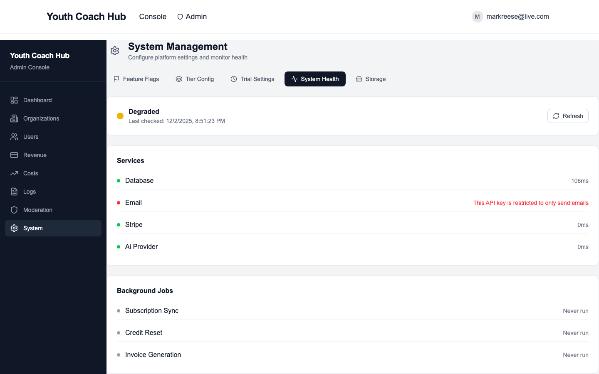

**Overall Status:**
- **Healthy** (green) - All systems operational
- **Degraded** (yellow) - Some issues detected
- **Unhealthy** (red) - Critical problems

**Services Monitored:**
- **Database** - PostgreSQL connection and latency
- **Email** - Email service status
- **Stripe** - Payment processing
- **AI Provider** - AI service availability

**Background Jobs:**
- **Subscription Sync** - Syncs Stripe subscriptions
- **Credit Reset** - Monthly AI credit reset
- **Invoice Generation** - Creates invoices

**Status Indicators:**
- Green dot - Healthy/Success
- Yellow dot - Degraded/Warning
- Red dot - Unhealthy/Failed
- Gray dot - Never run

---

### Storage Settings

Configure video storage limits and quotas.

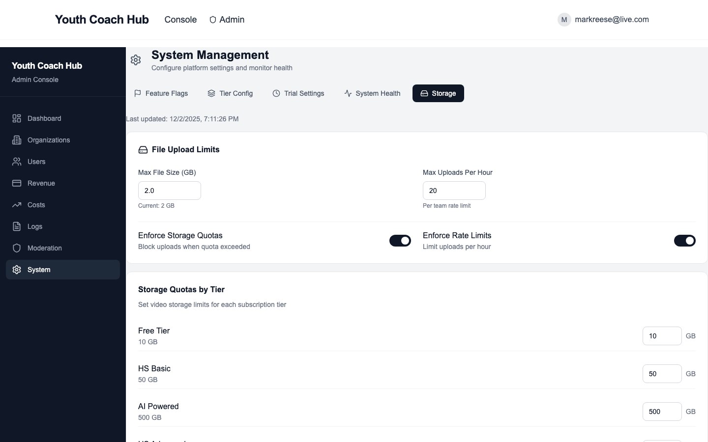

**File Upload Limits:**
- **Max File Size** - Maximum upload size (default: 2 GB)
- **Max Uploads Per Hour** - Rate limit per team

**Enforcement Toggles:**
- **Enforce Storage Quotas** - Block uploads when quota exceeded
- **Enforce Rate Limits** - Limit uploads per hour

**Storage Quotas by Tier:**

| Tier | Default Quota |
|------|---------------|
| Free | 5 GB |
| Basic | 10 GB |
| Plus | 50 GB |
| Premium | 200 GB |
| AI Powered | 500 GB |

**Allowed File Types:**
- `.mp4`, `.mov`, `.webm`, `.avi`, `.m4v`, `.mpeg`

---

## Best Practices

### Daily Tasks

1. Check the dashboard for alerts
2. Review pending content moderation queue
3. Monitor failed payments

### Weekly Tasks

1. Review new signups and trial conversions
2. Check AI costs vs. budget
3. Review error logs for recurring issues

### Monthly Tasks

1. Analyze churn and take action
2. Review tier pricing vs. costs
3. Update feature flags as needed
4. Export audit logs for compliance

---

## Troubleshooting

### Common Issues

**User can't access their account:**
1. Check if account is deactivated
2. Send password reset email
3. Verify email is correct

**Organization not showing data:**
1. Check database health in System Health
2. Verify subscription is active
3. Review error logs

**High AI costs:**
1. Check costs by organization
2. Identify heavy users
3. Consider adjusting tier quotas

**Failed payments:**
1. Review failed payment details
2. Contact customer if card issue
3. Retry payment if temporary failure

---

## Security Notes

- All admin actions are logged
- Use platform admin access sparingly
- Never share admin credentials
- Report suspicious activity immediately

---

**Questions?** Contact the development team for assistance.
