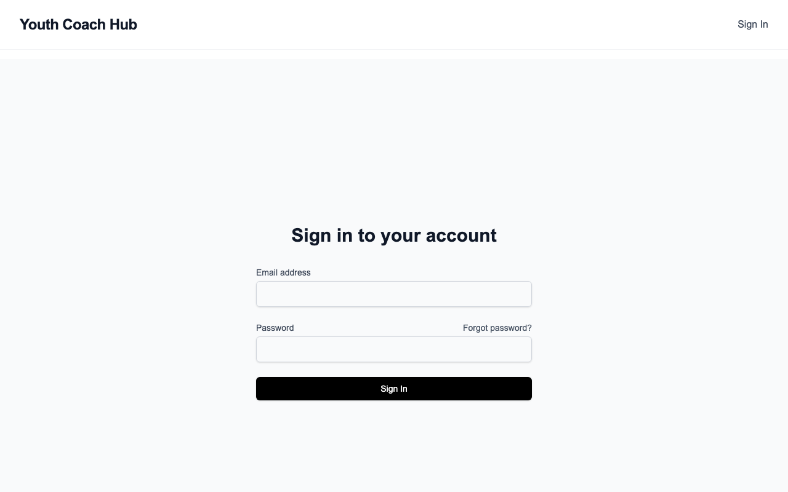
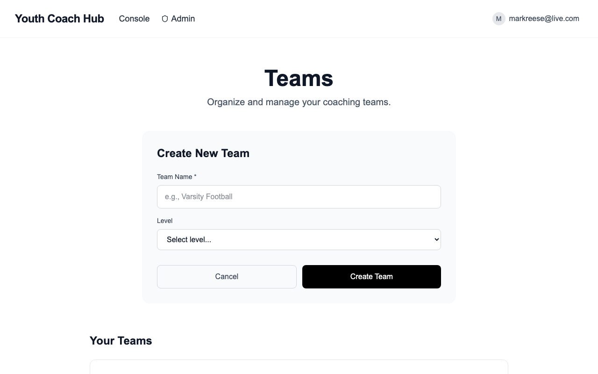
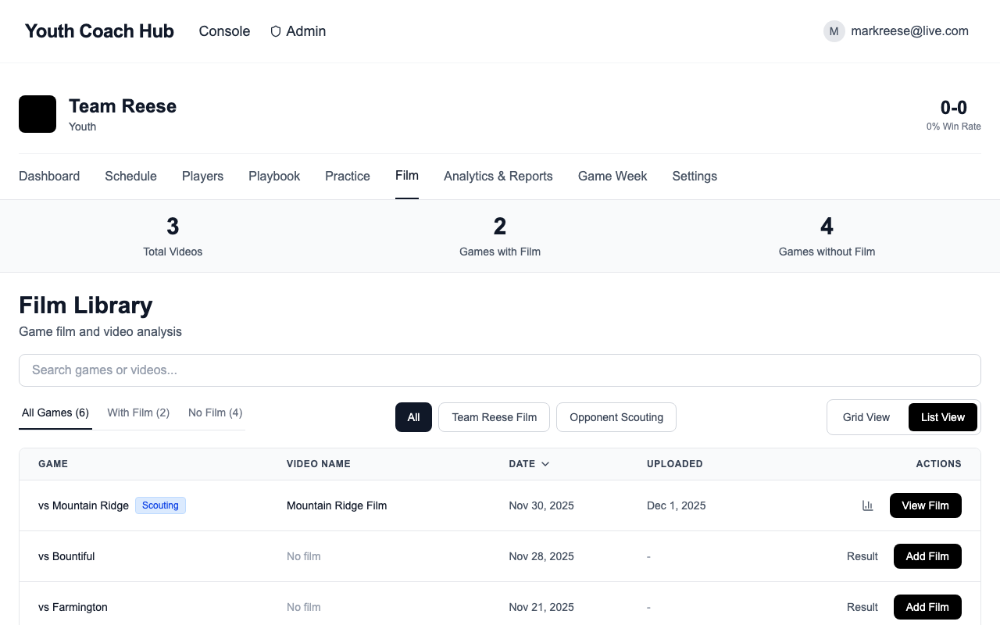

# Getting Started with Youth Coach Hub

Welcome to Youth Coach Hub! This guide will help you set up your account and start using the app to organize your team, upload game film, and analyze plays.

---

## What is Youth Coach Hub?

Youth Coach Hub is a football coaching platform designed for youth and high school coaches. Upload your game film, tag plays, and track your team's performance—all in one place.

---

## 1. Creating Your Account

**Step 1:** Go to [youthcoachhub.com](https://youthcoachhub.com)

**Step 2:** Click **"Get Started"** on the homepage

**Step 3:** You'll be directed to the login page. Enter your email and password.

**Step 4:** Check your email for a verification link (if required) and click it to confirm your account.

**Step 5:** Log in with your credentials.

---

## 2. Setting Up Your Team

After logging in, you'll need to create your team.

**Step 1:** Click **"+ Create New Team"**

**Step 2:** Enter your team name (e.g., "Varsity Football" or "7th Grade Eagles")

**Step 3:** Select your team level:
- Youth
- Middle School
- JV
- Varsity
- College

**Step 4:** Click **"Create Team"**

You'll be taken to your team dashboard where you can see your schedule, playbook, and film library.

---

## 3. Uploading Game Film

**Step 1:** From your team dashboard, click **"Film"** in the navigation

**Step 2:** Click **"Add Game"** to create a new game entry (or select an existing game)

**Step 3:** Enter the game details:
- Game name (e.g., "Week 1")
- Opponent name
- Date
- Location (optional)

**Step 4:** Click **"Add Film"** or **"View Film"** on the game

**Step 5:** Drag and drop your video file, or click to browse

**Supported formats:** MP4, MOV, WebM, AVI, M4V, MPEG

**Maximum file size:** 2 GB per video

**Step 6:** Wait for the upload to complete. Large files may take a few minutes.

---

## 4. Tagging & Analyzing Plays

Once your video is uploaded, you can tag individual plays.

**Step 1:** Open a game and click on a video to view it

**Step 2:** Use the video player to navigate to a play

**Step 3:** Click **"Tag Play"** or use the play tagging form

**Step 4:** Fill in the play details:
- **Down & Distance:** 1st and 10, 3rd and 5, etc.
- **Yard Line:** Where the play started
- **Play from Playbook:** Select the play that was called
- **Result:** Gain, loss, touchdown, incomplete, etc.
- **Yards Gained:** How many yards the play gained
- **Notes:** Any additional observations

**Step 5:** Click **"Save"** to record the play

Tagged plays appear as markers on the video timeline, making it easy to jump to specific plays later.

---

## 5. Tips for Success

1. **Tag plays right after the game.** The details are fresh in your mind, and you'll save time later when game planning.

2. **Use consistent naming.** Name your games and videos consistently (e.g., "Week 1 vs Lincoln") so they're easy to find.

3. **Start simple.** Begin by tagging just down, distance, and result. You can add more detail as you get comfortable with the app.

---

## Need Help?

If you have questions or run into issues, visit [youthcoachhub.com/contact](https://youthcoachhub.com/contact) or email support.

Happy coaching!
